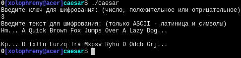

# caesar

Применить шифр Цезаря к тексту

## Использование

### Сборка

Компилировать `caesar.cpp`, например: `g++ caesar.cpp -o caesar`

### Запуск

Открыть полученную программу в текстовой консоли (терминале)

---
*Этот репозиторий является учебным заданием*

*This repo is part of a study task*
